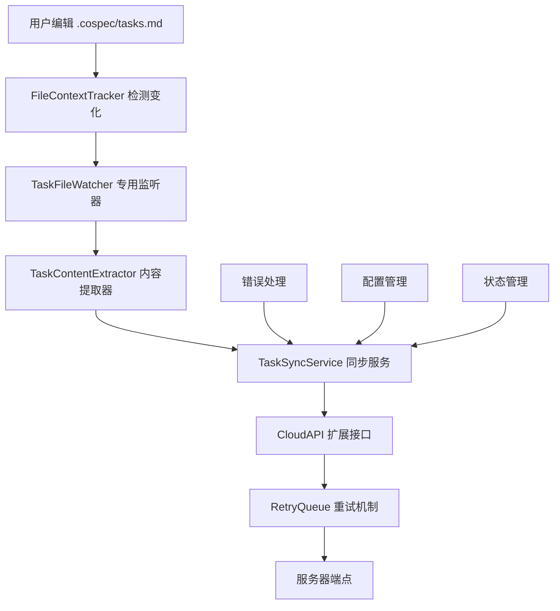
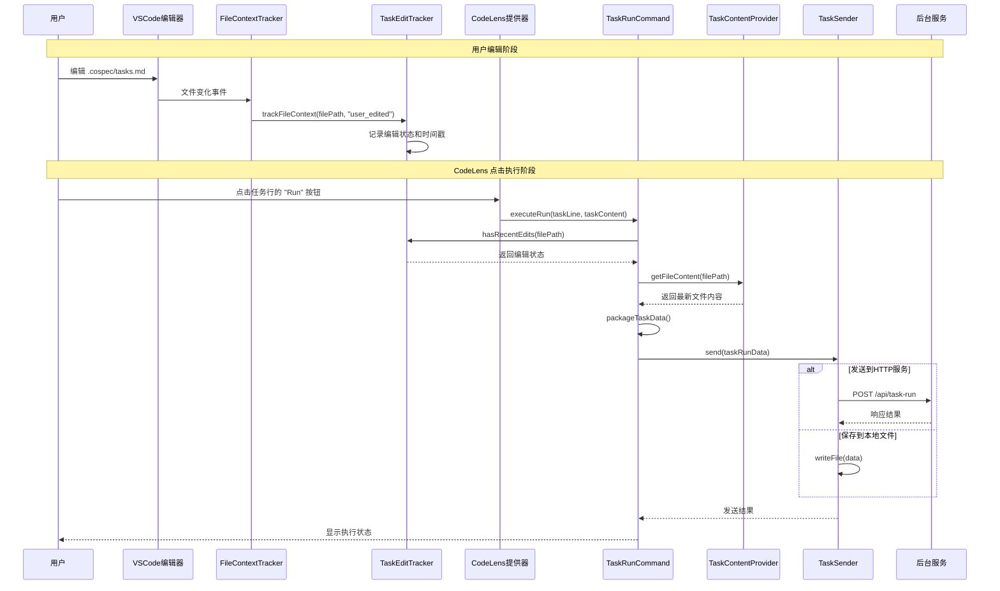
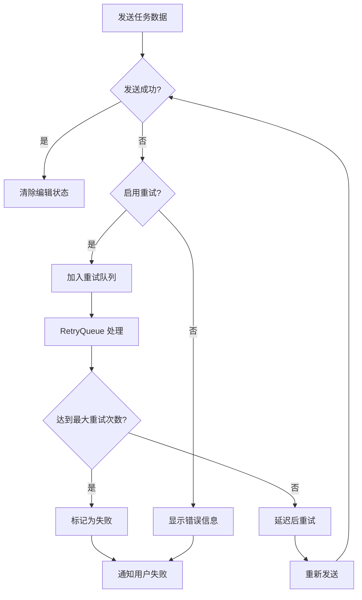

# .cospec/tasks.md 文件编辑内容发送功能技术方案

## 1. 项目概述

### 1.1 需求描述

实现用户编辑 `.cospec/tasks.md` 文件后，在点击 CodeLens "Run" 按钮时将编辑内容发送到后台服务的功能。后台服务可以是本地 HTTP 服务、远程 API 服务或本地文件存储。

### 1.2 核心目标

- 利用现有 FileContextTracker 机制检测用户编辑
- 在 CodeLens 点击时获取完整文件内容和编辑状态
- 支持灵活的后台发送方式（HTTP/文件/API）
- 提供可靠的错误处理和重试机制
- 确保不影响现有功能的正常运行

## 2. 现有架构分析

### 2.1 关键组件

- **FileContextTracker**: 文件监控和元数据跟踪机制
- **CloudService**: 云服务管理器，包含认证和重试机制
- **CloudAPI**: HTTP API 客户端
- **RetryQueue**: 重试队列机制，支持持久化和错误处理

### 2.2 现有数据结构

```typescript
// 文件元数据结构
interface FileMetadataEntry {
	path: string
	record_state: "active" | "stale"
	record_source: "read_tool" | "user_edited" | "roo_edited" | "file_mentioned"
	roo_read_date: number | null
	roo_edit_date: number | null
	user_edit_date: number | null
}

// 重试队列请求结构
interface QueuedRequest {
	id: string
	url: string
	options: RequestInit
	timestamp: number
	retryCount: number
	type: "api-call" | "telemetry" | "settings" | "other"
	operation?: string
}
```

## 3. 整体架构设计

### 3.1 架构概览



### 3.2 核心组件设计

#### TaskEditTracker (任务编辑跟踪器)

- 继承现有 FileContextTracker 机制
- 专门监听 `.cospec/tasks.md` 文件变化
- 记录编辑状态和时间戳

#### TaskContentProvider (任务内容提供器)

- 解析 Markdown 格式的任务文件
- 提取任务状态、内容和元数据
- 支持任务行号定位

#### TaskSyncService (任务同步服务)

- 管理任务内容的发送逻辑
- 集成 RetryQueue 进行可靠传输
- 处理发送时机和配置管理

#### TaskSender (任务发送器)

- 支持多种发送方式（HTTP/文件/API）
- 提供统一的发送接口
- 集成错误处理和重试机制

## 4. 关键接口和数据结构

### 4.1 核心数据结构

```typescript
// 任务运行数据结构
interface TaskRunData {
	// 基本信息
	filePath: string // '.cospec/tasks.md'
	timestamp: number // 执行时间戳

	// 任务信息
	taskLine: number // 任务所在行号
	taskContent: string // 任务内容
	taskStatus: "pending" | "in-progress" | "completed" // 任务状态

	// 文件内容
	fullFileContent: string // 完整文件内容
	hasUserEdits: boolean // 是否包含用户编辑
	lastEditTime?: number // 最后编辑时间

	// 上下文信息
	workspacePath: string // 工作区路径
	taskId?: string // 关联的任务ID
	userId?: string // 用户ID（如果有认证）
}

// 发送器配置
interface TaskSenderConfig {
	type: "http" | "file" | "api"
	endpoint: string // HTTP URL 或文件路径
	headers?: Record<string, string>
	timeout?: number
	retryEnabled?: boolean // 是否启用重试
}

// 编辑跟踪状态
interface EditTrackingState {
	filePath: string
	lastEditTime: number
	hasUserEdits: boolean
	editCount: number
}
```

### 4.2 核心接口定义

```typescript
// 任务编辑跟踪器接口
interface ITaskEditTracker {
	onFileEdited(filePath: string, source: RecordSource): void
	hasRecentEdits(filePath: string): boolean
	getEditState(filePath: string): EditTrackingState | null
	clearEditState(filePath: string): void
}

// 任务内容提供器接口
interface ITaskContentProvider {
	getFileContent(filePath: string): Promise<string>
	parseTaskAtLine(content: string, line: number): TaskInfo | null
	extractAllTasks(content: string): TaskInfo[]
}

// 任务发送器接口
interface ITaskSender {
	send(data: TaskRunData): Promise<SendResult>
	configure(config: TaskSenderConfig): void
	testConnection(): Promise<boolean>
}

// 发送结果
interface SendResult {
	success: boolean
	error?: string
	responseData?: any
	timestamp: number
}
```

## 5. 数据流程设计

### 5.1 主要数据流程



### 5.2 错误处理流程



## 6. 实现步骤规划

### 阶段一：基础设施搭建（1-2天）

1. **扩展 FileContextTracker**

    - 在现有 FileContextTracker 中添加任务文件特殊处理
    - 创建 TaskEditTracker 类
    - 添加编辑状态持久化

2. **创建核心数据结构**
    - 定义 TaskRunData、TaskSenderConfig 等接口
    - 添加 Zod 验证模式
    - 实现序列化和反序列化

### 阶段二：内容提取和处理（2-3天）

3. **实现任务内容提取器**

    - 创建 TaskContentProvider
    - 实现 Markdown 任务解析
    - 添加任务行号定位功能

4. **集成 CodeLens 命令处理**
    - 扩展现有 CodeLens 提供器
    - 创建 TaskRunCommand 处理器
    - 集成文件内容获取和状态检查

### 阶段三：发送机制实现（2-3天）

5. **实现灵活的发送器**

    - 创建 TaskSender 支持多种发送方式
    - 集成现有 RetryQueue 机制
    - 实现错误处理和重试

6. **配置管理系统**
    - 添加 VSCode 设置配置项
    - 实现配置验证和默认值
    - 添加配置变更实时生效

### 阶段四：错误处理和优化（1-2天）

7. **完善错误处理**

    - 实现分类错误处理
    - 添加用户友好的错误提示
    - 集成日志系统

8. **性能优化和测试**
    - 添加防抖机制
    - 实现性能优化
    - 编写单元测试和集成测试

### 阶段五：集成和部署（1天）

9. **扩展激活集成**

    - 在 extension.ts 中注册服务和命令
    - 更新 package.json 配置
    - 确保兼容性

10. **文档和发布准备**
    - 编写使用文档
    - 更新 README 和 CHANGELOG
    - 准备发布说明

## 7. 潜在风险和解决方案

### 7.1 技术风险

- **文件监控性能影响**: 实现防抖机制，复用现有监控
- **大文件处理性能**: 流式读取，文件大小限制
- **网络请求失败**: 集成 RetryQueue，指数退避重试

### 7.2 数据安全风险

- **敏感信息泄露**: 数据脱敏，敏感词过滤
- **未授权访问**: 集成现有认证，HTTPS 要求

### 7.3 用户体验风险

- **配置复杂性**: 配置向导，预设模板
- **功能发现性**: 清晰的操作提示，使用指南

### 7.4 兼容性风险

- **与现有功能冲突**: 基于现有架构扩展
- **VSCode API 变更**: 使用稳定 API，版本兼容

## 8. 核心实现示例

### 8.1 TaskEditTracker 实现

```typescript
class TaskEditTracker {
	private editStates = new Map<string, EditTrackingState>()

	onFileEdited(filePath: string, source: RecordSource) {
		if (filePath.endsWith(".cospec/tasks.md") && source === "user_edited") {
			const state: EditTrackingState = {
				filePath,
				lastEditTime: Date.now(),
				hasUserEdits: true,
				editCount: (this.editStates.get(filePath)?.editCount || 0) + 1,
			}
			this.editStates.set(filePath, state)
		}
	}

	hasRecentEdits(filePath: string): boolean {
		return this.editStates.get(filePath)?.hasUserEdits || false
	}
}
```

### 8.2 TaskSender 实现

```typescript
class TaskSender implements ITaskSender {
	constructor(private config: TaskSenderConfig) {}

	async send(data: TaskRunData): Promise<SendResult> {
		try {
			switch (this.config.type) {
				case "http":
					return await this.sendToHttp(data)
				case "file":
					return await this.saveToFile(data)
				case "api":
					return await this.sendToApi(data)
			}
		} catch (error) {
			if (this.config.retryEnabled) {
				// 加入重试队列
				await this.enqueueForRetry(data)
			}
			throw error
		}
	}

	private async sendToHttp(data: TaskRunData): Promise<SendResult> {
		const response = await fetch(this.config.endpoint, {
			method: "POST",
			headers: {
				"Content-Type": "application/json",
				...this.config.headers,
			},
			body: JSON.stringify(data),
		})

		return {
			success: response.ok,
			responseData: await response.json(),
			timestamp: Date.now(),
		}
	}
}
```

## 9. 配置示例

### 9.1 VSCode 设置配置

```json
{
	"costrict.taskSync.enabled": true,
	"costrict.taskSync.type": "http",
	"costrict.taskSync.endpoint": "http://localhost:3000/api/task-run",
	"costrict.taskSync.headers": {
		"Authorization": "Bearer your-token"
	},
	"costrict.taskSync.retryEnabled": true,
	"costrict.taskSync.timeout": 30000
}
```

### 9.2 本地文件配置
